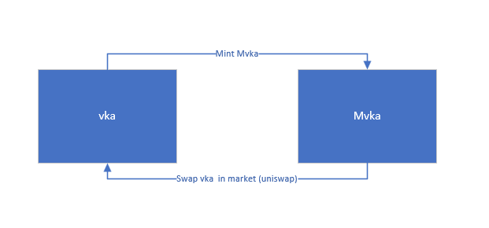
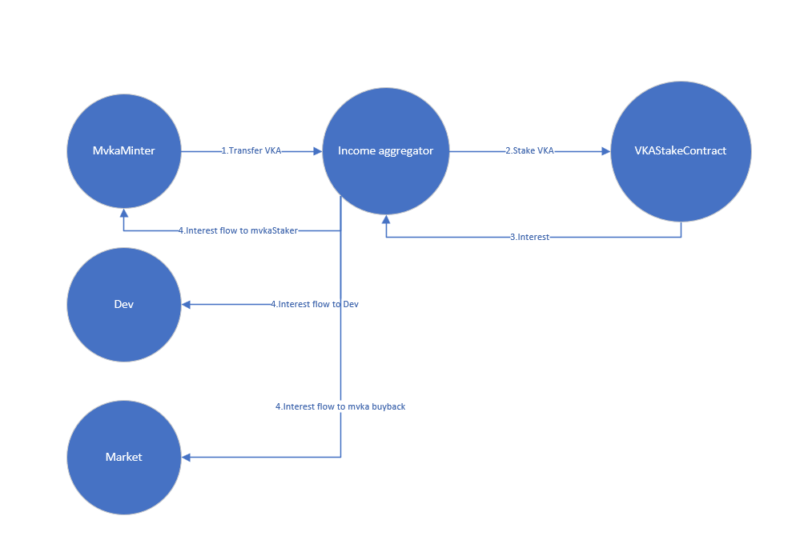
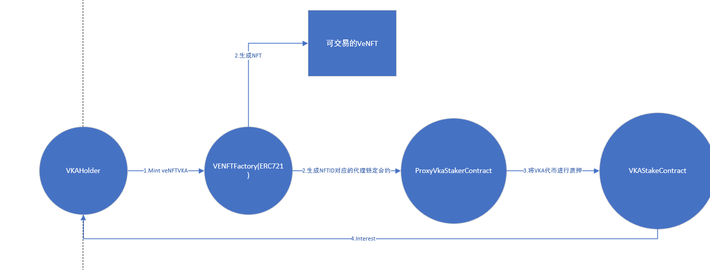
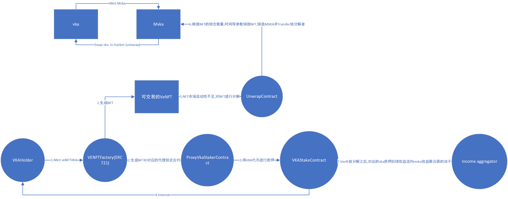

# PreIdea

web3项目发射治理代币是一种很常见的社区治理模式,但是很多项目方并不会经常发起有益于社区的提案,所以我们可以基于治理代币的投票权构建一个项目,用户可以自由的在平台上发起提案并且为提案投票,提案的发起需要投入一定的资金,且在页面显示的时候按照投入金额的多少进行排序显示,而所有投入的钱会进入一个总的奖池如果提案最近被项目方接受,则该提案的发起者会获得奖池里面的资金作为奖励鼓励对社区有建设性的提案出现。

# IDEA思路

质押作为Defi必不可少的一个板块,是一个非常有价值的关注点,越来越多的项目采用Ve质押模型,即通过锁定平台的治理代币获得平台的收益分成,为了抗通胀,一般的项目都会为质押提供一个相对较长的锁定期,用户如果想要收益最大化,需要一直增加锁定期,对于用户来说其实极其不友好,**一切波动的东西都可以交易,而交易的产生往往能为平台带来真实的收益（如手续费等收益来源）**，所以引入波动和流动性正式我们想干的事情。

# 市场定位

​	我们以质押市场作为切入点推出第一款质押收益聚合产品,推出MVKA及VENFT(VKA)两款产品,在当前这个发币即巅峰的市场下,暂且不选择发行任何平台的治理代币,而是选择于一些优质项目进行共生。

 	vaultka是一个基于GMX,HMX等去中心化永续合约交易所的杠杆做市产品,作为Vaultka的治理代币,用户可以通过质押vka代币获得项目的收益分成,但需要进行最长两年的代币锁定,以下是选择vaultka进行共生的原因。

1. vaultka是一个很有潜力的产品,其真实收益的理念可以保证其项目不会轻易死掉。

2. vaultka项目方并没有针对质押用户锁定之后无法退出的问题提出解决方案,无限期的延长锁定导致用户无法退出协议,没有进场的用户也不敢轻易的进场,这导致的vka代币在市场上的流动性非常差,虽然项目拥有了超过2000万美金的tvl,且极具潜力,但是治理代币仍然长时间的陷入流动性困扰。		

   

# 市场已有流动性解决方案

市场上已有的流动性解决方案主要有两种,再质押代币和NFT的方案

## 在质押代币方案

收益聚合器项目penpie为penpie提供的方案（再质押代币）

penpie推出了mToken,mPendle,可以称为流动性版本的Pendle代币,用户可以在协议中将Pendle转换为mPendle代币,这个过程为单向转换。

```
比如在用户进行转换的时候1个Pendle代币根据市场汇率可以获得5个mpendle代币,但是在一端时间之后随着市场波动,可能5个mPendle代币在市场上只能换回0.8个Pendle代币了
```

penpie 在Convert的同时会将Pendle代币在Pendle中进行最长期锁定,后续会将Pendle产生的收益在mpendle质押者和其他利益方进行分配。

若mpendle持有人想要推出协议,则可以通过二级市场售出mpendle推出协议。

总结:

> 这个解决防范是通过引入新的erc20代币解决问题,对于用户来说和直接去Pendle质押相比,直接去质押当到达解锁期之后能保证Pendle代币存进去多少就能解锁多少出来,不会出现Pendle币本位的亏算。引入mToken相当于牺牲了这种1：1的比例关系,但是得到了时间上随时可以退出协议的补偿

## NFT方案

aero 治理代币NFT的方案

aero 治理代币aero的质押同样有锁定时间这个维度,但是质押合约和质押者之间增加了一层NFT的抽象,所以用户可以通过交易NFT的方式退出协议,即锁定者绑定的是nft的id,只要是拥有nft的eoa地址就可以获得质押的收益。

总结:

> 这个解决防范是通过引入新的erc721NFT解决问题,NFT的方案可以为质押者提供退出的方案,但是受限于NFT的流动性问题,其实交易市场的流动性会更差,所以其实并不好退出

# Wave Finance方案

对比市场方案的优点和缺点,Wave Finance 视图寻求融合方案,为更多的用户提供可选方案,在mpendle的方案中,引入了erc20代币,但是可能导致pendle代币比本位的损失,而aero的erc721NFT方案受限于流动性限制,每种缺点都会导致特定偏好用户损失。所以Wave Finance 推出了 **再质押代币+NFT** **融合**方案,并且可以通过类erc7527这样的方案连通erc20和erc721,基于此理念推出了mVKA代币以及veVKANFT

# 代币经济学

## mvka



用户可以将vka代币在Wave Finance 中将Vka代币转换为mvka代币,转换过程会参考二级市场的汇率,并提供一定的**抽奖补贴汇率**鼓励用户通过Wave Finance 转化获得mvka而非通过二级市场交易获得,需要注意转换过程为单向转换,无法通过Mvka转换获得vka,用户可以通过uniswap这样的市场卖出mvka。



在Wave Finance 收到用户的vka代币后,Wave Finance会最长期锁定（2年）vka代币到vaultka的锁定合约当中去,收益聚合合约作为质押者,会将从vaultka项目中获得的收益重新进行分配,mvka持有者因此享受到vaultka项目的收益分成.

## veVKANFT



用户可以通过Vka代币在Wave中铸造veVKANFT,使用体验与在vaultka项目中质押几乎没有区别,用户选择锁定的数量和时间并协议NFT的MetaData中,同时Wave会为用户创建一个代理质押合约,这个质押合约会代为用户进行质押和收益领取等操作,而这个合约的操作权限由NFT的持有地址所有,用户可以通过交易VeNFT推出协议.

## veVKANFT unwrap




为了解决NFT流动性差的问题,用户可以在NFT无法出售时将NFT直接进行销毁得到Mvka代币,在通过二级市场售出代币,而NFT持有者拥有的vka锁定头寸将会转移到mvka的聚合器当中以此抵消销毁NFT时带来的mvka增发通胀影响。

# WaveFinance的价值

## 1.对于vaultka这样的项目方:

解决他们的流动性困扰,然后用户更无后患的去购买vka代币,且当用户推出协议时不会出现vka等治理代币的解锁和抛售。

## 2.对于想要参与vka等治理代币的质押用户

为厌恶锁定时间但能接受中途割肉离场的用户提供了多种选择：

1.不想承受vka币本位损失的用户可以选择,veVKA的方案,这个方案可以在解锁时间结束后1:1的得到vka治理代币,同时在急需推出协议的时候通过销毁NFT推出协议。

2.对于能够接受vka代币比本位的用户,可以通过转化为mvka代币获得比VeNFT方案更快的收益速度（将会在下一节讲到）

# Wave 飞轮

若mvka的代币在市场波动中下跌,则用户退出协议后会获得进入协议时更少的vka治理代币,而这个差额可以当作用户割肉离场的代价,也可以作为Wave的价值基石,在NFT的销毁过程中也会积累治理代币,随着价格的波动,Wave协议将会积累越来越多的vka治理代币。

# RoadMap

Wave Finance 目前暂时不会发射自己的平台代币,正如你所见,mtoken,以及venft都是基于第三方面项目进行信用传递的,在WaveFinance推出了足够多好用的项目之后才会考虑发射自己的平台币,并发挥作用。

Roud1:wave vka

Roud2: .............